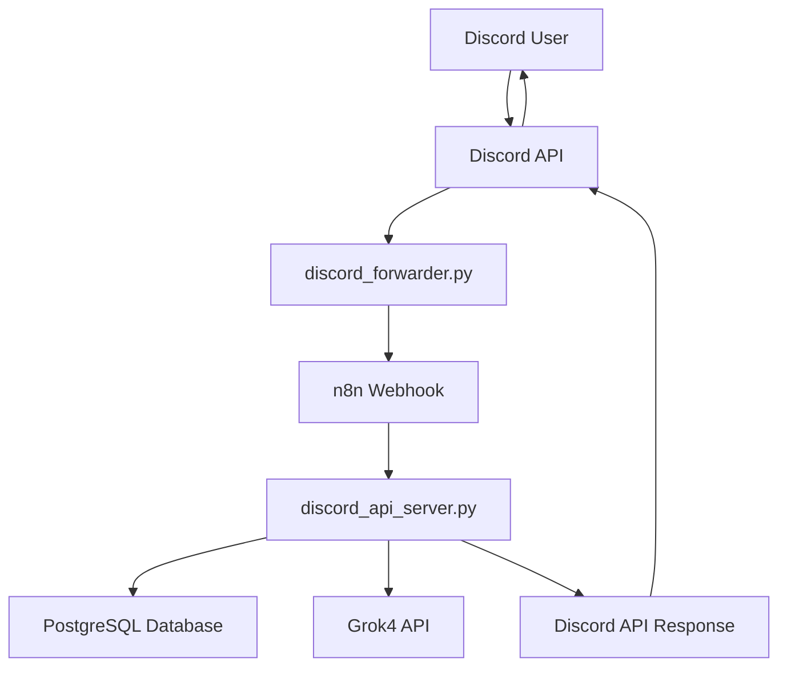

# Architecture Overview

**SuperAgent n8n Discord bot system design and technical architecture.**

## System Architecture

### High-Level Flow
```
Discord Message → Python Bot → n8n Webhook → Python API Server → PostgreSQL + Grok4 + Discord Response
```

### Component Breakdown



## Component Details

### 1. Discord Forwarder (`discord_forwarder.py`)

**Purpose**: Lightweight Discord event handler that forwards messages to n8n

**Responsibilities**:
- Connect to Discord API using bot token
- Listen for message events in configured channels
- Filter messages (mentions, keywords, role mentions)
- Forward relevant messages to n8n webhook
- Minimal processing, maximum reliability

**Key Features**:
- Async Discord.py integration
- Message filtering (direct mentions, role mentions, keyword detection)
- JSON payload formatting for n8n
- Error handling and reconnection logic

### 2. n8n Workflow Engine

**Purpose**: Orchestration layer for message routing and workflow management

**Responsibilities**:
- Receive Discord webhooks
- Route messages to appropriate processors
- Handle workflow state and execution
- Visual workflow management interface

**Benefits**:
- Visual workflow design and debugging
- Built-in error handling and retries
- Execution logging and monitoring
- Easy workflow modifications without code changes

### 3. Python API Server (`discord_api_server.py`)

**Purpose**: Core business logic processor handling AI, database, and Discord operations

**Responsibilities**:
- Parse n8n webhook data
- Manage user data and message storage
- Build conversation context from database
- Call Grok4 API with memory context
- Handle API timeouts and errors
- Send responses back to Discord
- Store bot responses for future context

**Key Features**:
- Flask REST API server
- PostgreSQL database operations
- Conversation memory management
- Grok4 API integration
- Discord API posting
- Comprehensive error handling

### 4. PostgreSQL Database

**Purpose**: Persistent storage for users, messages, and conversation memory

**Schema**:
```sql
-- User management
discord_users (id, username, display_name, created_at, updated_at)

-- Message history  
messages (id, discord_message_id, user_id, content, metadata, message_type, agent_name, created_at)

-- Additional tables for future features
conversations, entities, tool_calls, agent_metrics
```

### 5. Supporting Infrastructure

**Docker Compose Stack**:
- **n8n**: Workflow engine container
- **PostgreSQL**: Database container
- **Redis**: Caching layer (for future use)

## Data Flow

### 1. Message Processing Flow
1. **Discord Event**: User mentions bot or uses trigger keyword
2. **Event Filtering**: discord_forwarder.py filters relevant messages
3. **Webhook Call**: Formatted JSON sent to n8n webhook
4. **n8n Processing**: Workflow routes to Python API
5. **Data Extraction**: API server parses Discord message data
6. **Database Operations**:
   - Ensure user exists in discord_users table
   - Retrieve conversation history for context
   - Store current user message
7. **AI Processing**:
   - Build conversation context with history
   - Call Grok4 API with memory-enhanced prompts
   - Handle API responses and errors
8. **Response Handling**:
   - Store bot response in database
   - Send response to Discord via API
   - Handle Discord reply threading if applicable

### 2. Memory System
```
User Message → Store in DB → Retrieve History → Build Context → AI Response → Store Response
```

**Memory Features**:
- Per-user conversation history
- Channel-specific context isolation
- Configurable history limits (default: 15 messages)
- Metadata storage for message threading
- Agent response attribution

## Design Decisions

### Why n8n + Python API vs Pure Python?

**Advantages of Hybrid Architecture**:
- **Visual Debugging**: n8n provides clear execution visualization
- **Reliability**: n8n handles HTTP routing robustly
- **Flexibility**: Easy to modify workflows without code changes
- **Monitoring**: Built-in execution logs and error tracking
- **Scalability**: Easy to add new workflows and routes

**Pure Python Challenges We Avoided**:
- Complex async/sync coordination
- Manual error handling and retries
- Webhook routing and management
- Execution monitoring and debugging

### Database Design Choices

**PostgreSQL over SQLite**:
- Better concurrent access handling
- JSON metadata support
- Production scalability
- Docker container compatibility

**Message-Centric Schema**:
- Simple conversation history retrieval
- Easy context building for AI prompts
- Flexible metadata storage
- Future feature extensibility

### Error Handling Strategy

**Multi-Layer Error Handling**:
1. **Discord Level**: Connection retries, event filtering
2. **n8n Level**: Built-in workflow error handling
3. **API Level**: Graceful degradation, fallback responses
4. **Database Level**: Transaction safety, connection pooling

## Performance Characteristics

### Response Times
- **Discord to n8n**: <50ms
- **n8n to API**: <100ms  
- **Database queries**: <50ms
- **Grok4 API**: 1-5 seconds
- **Total response**: 2-6 seconds

### Scalability Limits
- **Concurrent users**: 1000+ (limited by Grok4 API rate limits)
- **Message throughput**: 100+ messages/minute
- **Database storage**: Unlimited (PostgreSQL scales well)
- **Memory usage**: ~500MB for full stack

## Security Model

### Credential Management
- Environment variables for all secrets
- No hardcoded API keys or tokens
- Docker secrets for database credentials
- Bot token permissions following least privilege

### Data Protection
- User messages stored in private database
- No message content logged in plaintext
- Database connections encrypted
- API endpoints not exposed externally

### Access Control
- Discord bot permissions managed via Discord
- Database access restricted to API server
- n8n interface protected by authentication
- Network isolation via Docker

## Monitoring and Observability

### Built-in Monitoring
- **API Health Endpoint**: `/health` for service status
- **Database Inspector**: `check_database.py` for data verification
- **n8n Execution Logs**: Visual workflow execution tracking
- **Application Logs**: Structured logging in Python services

### Metrics Collection
- Message processing counts
- API response times
- Error rates and types
- Database query performance
- Grok4 API usage and costs

## Future Architecture Enhancements

### Planned Improvements
1. **Load Balancing**: Multiple API server instances
2. **Caching Layer**: Redis for frequently accessed data
3. **Message Queuing**: Async processing for high-volume scenarios
4. **Microservices**: Split API server into specialized services
5. **Vector Database**: Semantic search and RAG capabilities

### Integration Points
- **File Storage**: S3/MinIO for Discord attachments
- **Vector Search**: Pinecone/Weaviate for semantic memory
- **Multi-LLM**: Claude, Gemini routing capabilities
- **Web Dashboard**: React frontend for management
- **Analytics**: Time-series data for usage insights

This architecture provides a solid foundation for a production Discord bot with room for significant future enhancements. 🚀